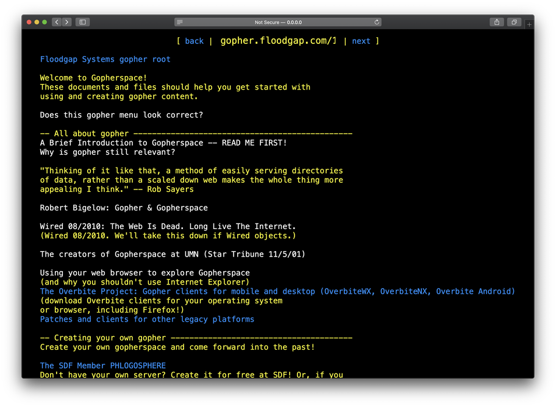

:warning: phroxy is no longer in development and has been archived. thanks for all the fun. :warning:

---

<!--
      /            \    /
 ___ (___  ___  ___ \  /
|   )|   )|   )|   ) \/  \   )
|__/ |  / |    |__/  /\   \_/
|                   /  \   /
                   /    \
--> 
   

`phroxy` is a small, multi-threaded web server that proxies Gopher
requests through HTTP. It's meant to be run locally or behind an HTTPS
proxy and was written for [gogo](https://github.com/xvxx/gogo), a
WebKit-based Gopher desktop client.

To use it locally, run `phroxy` in a terminal then visit its URL
in your favorite web browser. You'll be burrowin' through the
Gophersphere in no time!

If you want to setup a private instance of phroxy on the real web so
you can browse Gopher using your tablet or TV, we recommend running it
behind an HTTPS proxy like [Caddy](https://caddyserver.com/v1/):

    $ cat Caddyfile
    your-website.com
    proxy / localhost:8080
    $ sudo caddy -host your-website.com
    # in another terminal:
    $ phroxy -p 8080
    Listening at http://0.0.0.0:8080...

Behind the scenes, phroxy attempts to make all Gopher connections
using "secure Gopher" (TLS). If that doesn't work, it drops to a
regular TCP connection.

## screenies

|||
|:-:|:-:|
| The Lonely Cabin | sdf.org |

|||
|:-:|:-:|
| gopherproject.org | gopherproject.org |

## usage

        phroxy [options]

    Options:

        -p, --port NUM    Port to bind to.
        -h, --host NAME   Hostname to bind to.
        -g, --gopher URL  Default Gopher URL to load.

    Other flags:

        -h, --help        Print this screen.
        -v, --version     Print phroxy version.

## installation

phroxy is currently only available through https://crates.io/:

    cargo install phroxy

You can also build a release binary yourself by cloning this
repository:

    git clone https://github.com/xvxx/phroxy
    cd phroxy
    cargo build --release
    ./target/release/phroxy -h

## development

    cargo run -- -p 8080

You can set the start screen to your own Gopher server. [phd][phd]
perhaps?

    # start gopher
    phd
    ┬ Listening on 0.0.0.0:7070 at /Users/randy/Code/phroxy

    # then start phroxy
    cargo run -- -p 8080 -g 0.0.0.0:7070
    # and visit it in your web browser
    open http://127.0.0.1:8080

## credits

phroxy's design is based on
[phetch](https://github.com/xvxx/phetch)
and inspired by
[Gaufre](https://gitlab.com/commonshost/gaufre).

The proxy idea comes from older gopher/web proxy sites like
https://gopher.floodgap.com/gopher/.

It was made for gogo, which was inspired by lartu's
[OpenNapkin](https://github.com/Lartu/OpenNapkin) client.

## todo

- [ ] man page

